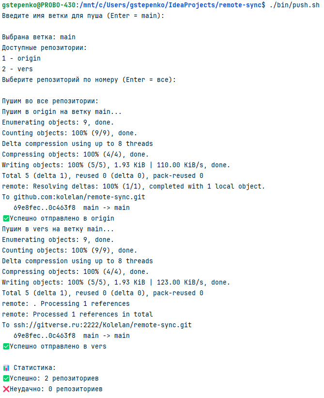

# Проект для отправки данных в несколько репозиториев
Часто бывает что репозиториев несколько github, gitverse, gitlab, chai ... 
Сделаем одновременный пуш во все репозитории.

Пусть скрипт bin/push.sh будет интерактивным: 

- Автоматически определяет все удалённые репозитории.
- Выполняет git push на указанную ветку для каждого из них.
- Сначала запрашивался название ветки (по умолчанию — текущая ветка).
- Затем запрашивался репозиторий, в который пушить (с выбором из списка или всем сразу).

## ✅ Скачайте скрипт `push.sh` в свой проект

Подготовьте папку для скрипта `bin/push.sh`:

```bash
mkdir -p bin
```
Теперь вы можете скачать скрипт напрямую из терминала, используя `curl` или `wget`.
### 🖥️ Скачать с помощью `curl` (рекомендуется)

```bash
curl -fsSL https://raw.githubusercontent.com/kolelan/remote-sync/main/bin/push.sh > bin/push.sh
```

---

### 🖥️ Скачать с помощью `wget`

```bash
wget -qO bin/push.sh https://raw.githubusercontent.com/kolelan/remote-sync/main/bin/push.sh
```
### Делаем файл исполняемым
```shell
chmod +x bin/push.sh
```
---

### Или всё за одну инструкцию
```bash
mkdir -p bin && \
curl -fsSL https://raw.githubusercontent.com/ваш_логин/ваш-репозиторий/main/bin/push.sh > bin/push.sh && \
chmod +x bin/push.sh
```

## Работаем с любым количеством репозиториев

Добавляем репозитории

```shell
git remote add origin https://github.com/ваш_логин/ваш_репозиторий.git
git remote add verse https://gitverse.org/ваш_логин/ваш_репозиторий.git
  
```


## Пример использования
```shell
./bin/push.sh
```
Вывод:
```shell
Введите имя ветки для пуша (Enter = main): 

Выбрана ветка: main

Доступные репозитории:
1 - origin
2 - verse
Выберите репозиторий по номеру (Enter = все): 1

Пушим только в репозиторий: origin

Пушим в origin на ветку main...
✅ Успешно отправлено в origin

📊 Статистика:
✅ Успешно: 1 репозиториев
❌ Неудачно: 0 репозиториев
=== Синхронизация завершена ===
```
## Что делает скрипт

- Автоматически получает список удалённых репозиториев через git remote.
- Для каждого репозитория:
  - Проверяет доступность через git ls-remote.
  - Выполняет git push.
- Логирует успех/ошибки.
- Выводит статистику.
## Пример работы


Если хотите автоматизировать это поведение глобально, можно также рассмотреть использование Git hooks или alias-ов, но для простой синхронизации — такой скрипт отлично подходит.